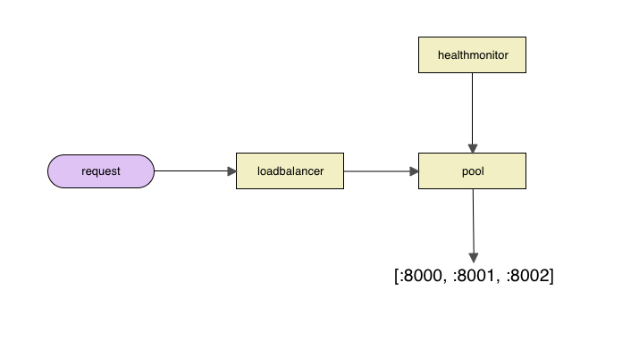

look4you
========

look4you is a [Go](http://golang.org/) client for loadbalancer.




Installation
------------

Install look4you using the "go get" command:

    go get github.com/FastSchnell/look4you/loadbalancer
    
    
Usage
-----
```go
import "look4you/loadbalancer"

endpoints := []string{"127.0.0.1:8000", "127.0.0.1:8001", "127.0.0.1:8002"}
lb := loadbalancer.Lb{Endpoints: endpoints}
lb.Init()
defer lb.Close()

endpoint, err := lb.GetEndpoint()
if err != nil {
	//do something
}
...
```


License
-------

look4you is available under the [Apache License, Version 2.0](http://www.apache.org/licenses/LICENSE-2.0.html).